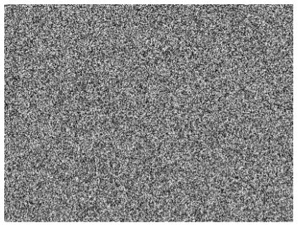
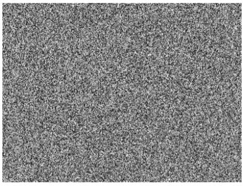
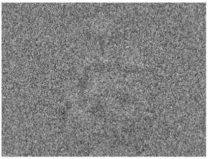
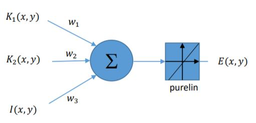
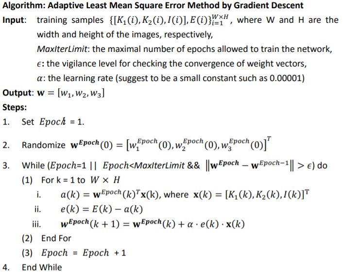
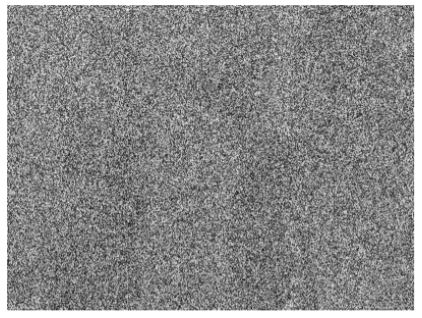
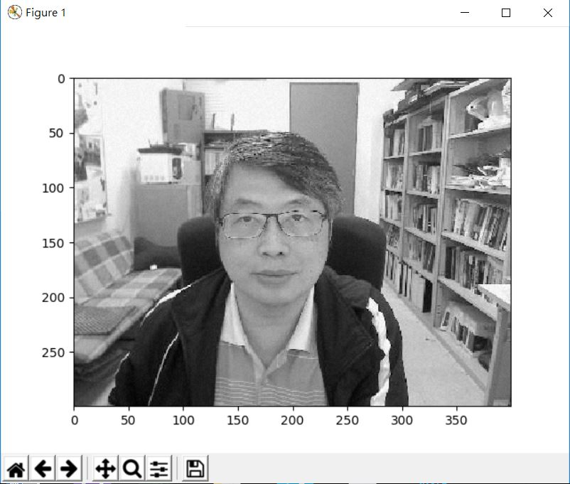
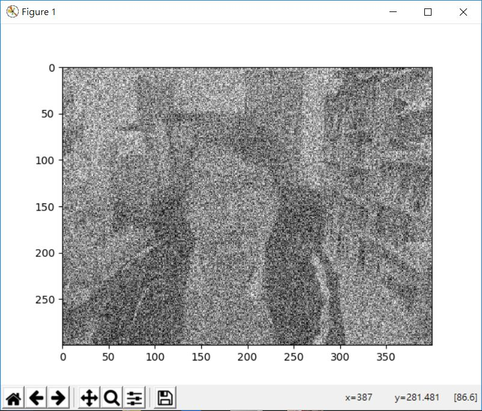

# NDHU 2018 Machine learning assignment1

## Instruction

>Encryption formula:  
𝐸 = 𝑤1𝐾1 + 𝑤2𝐾2 + 𝑤3𝐼  

>Decryption formula:  
𝐼 = (𝐸 − w1𝐾1 − 𝑤2𝐾2) / 𝑤3  

**Coefficient of w (w1,w2,w3)**  
𝐰 = [𝑤1, 𝑤2, 𝑤3]  
**Image Key1 (𝐾1)**  
  
**Image Key2 (𝐾2)**  
  
**Image be encrypted (𝐼)**  
  
**Encrypted image (𝐸)**  
  
  

## Algorithm  
  

## Experiment result  
**Initial 𝐰**  
w = [0,0,0]  
**Learning rate**  
𝛼 = 1e-5~1e-8  
**Result 𝐰**  
w = [0.2491433070972368, 0.6613819010415319, 0.08923952571665969]]  
**Eprime**  
  
**Decryption_Eprime**  
  

## Discussion  
實驗W初始值並不會造成劇烈影響  
因此將之設置為0  
當Learning rate低於1e-8時  
需要Epoch>=4次才能找出合適的W並解譯出清晰Decryption_Eprime  
  
