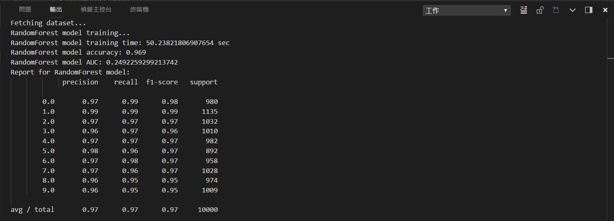
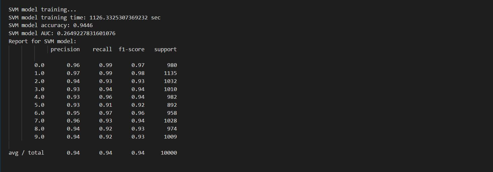

# NDHU 2018 Machine learning assignment2

## Instruction
The dataset is the MNIST database of handwritten digits, available from http://yann.lecun.com/exdb/mnist, which has a training set of 60,000 examples and a test set of 10,000 examples.

## Algorithm 
1.Downloading Dataset 

    # Fetching dataset
    data = fetch_mldata('MNIST original')

2.Preprocessing Character Images 

    # Normalize preprocessing
    X = X / 255

    # Split train data and test data
    n = 60000
    X_train = X[:n]
    y_train = y[:n]
    X_test = X[n:]
    y_test = y[n:]

    X_train = X_train.astype("float32")
    X_test = X_test.astype("float32")

    #Randomize train data
    shuffle_index = np.random.permutation(60000)
    X_train, y_train = X_train[shuffle_index], y_train[shuffle_index]

3.Reducing Dimension & Choosing a Classifier and Training It 

    def RandomForest_model(X_train, y_train, X_test, y_test):
    def SVM_model(X_train, y_train, X_test, y_test):

4.Evaluating the Performance 

    # Training time, Accuracy, AUC, PR, F1
    print("SVM model training time:",format(time_end-time_start),"sec")

    accuracy = metrics.accuracy_score(y_test, y_test_predict)
    print("SVM model accuracy:",accuracy)

    fpr, tpr, thresholds = metrics.roc_curve(y_test, y_test_predict, pos_label=2)
    auc = metrics.auc(fpr, tpr, reorder=False)
    print("SVM model AUC:",auc)

    print("Report for SVM model: \n%s" % (metrics.classification_report(y_test, y_test_predict)))

Randrom forest model 
https://en.wikipedia.org/wiki/Random_forest 
Support vector machine(SVM) 
https://en.wikipedia.org/wiki/Support_vector_machine 

## Experiment result 
  
  

## Discussion 
Training time 能用來判斷分類器的效能 
RandomForest model 相較於 SVM 明顯效能較好。 

Accuracy = 提取出的正確信息條數 / 總樣本 
Accuracy 直觀，但僅依靠高正確率並不能表示該分類器即為好的分類器 

AUC = 1，是完美分類器，採用這個預測模型時，不管設定什麼閾值都能得出完美預測。絕大多數預測的場合，不存在完美分類器。 
0.5 < AUC < 1，優於隨機猜測。這個分類器（模型）妥善設定閾值的話，能有預測價值。 
AUC = 0.5，跟隨機猜測一樣（例：丟銅板），模型沒有預測價值。 
0 < AUC < 0.5，比隨機猜測還差；但只要總是反預測而行，就優於隨機猜測。 
在此Dataset中兩分類器均有相似表現。

Precision = 提取出的正確信息條數 / 提取出的信息條數 
Recall = 提取出的正確信息條數 / 樣本中的信息條數 
F1 Score = Accuracy * Precision * 2 / (Accuracy + Precision) 
F1 score 是 Precision 和 Recall 的加權調和平均，分數越高證明分類器越有效 